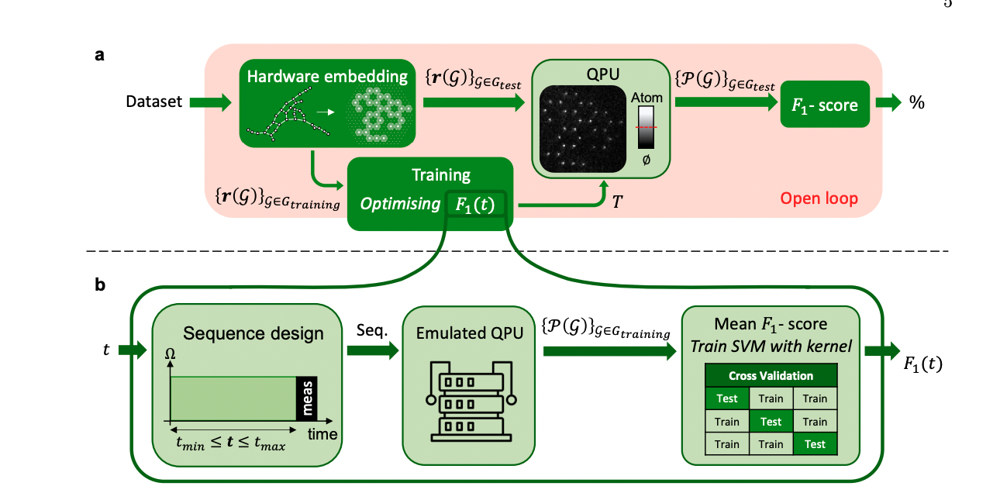

# qhack23_project
==================
 - Team name: QuantuMother
 - In this Readme.md for QHack 2023 `Quantum Graph Neural Network for graph structured data using classical initialization`, we are including notebooks or pdfs in this repository. This repository will contain the entire project.

## Completion Criteria:

1. We want to implement the quantum feature map (QEK) in reference [1], where they demonstrate a competitive result in classifying graph-structured datasets compared to graph neural networks (GNN). 
2. We can implement quantum GNN for the same classification tasks.
3. We aim to improve the accuracy of QGNN classification by use of CAFQA [4] to get best initialization points for the QGNN ansatz. Since, CAFQA works on classical simulator we wish to demonstrate the symbiosis of classical computing and Quantum computing leading to improvement of QC performance.

## Workflow

**Here are some steps::**
1. Set up AWS Bracket, because it will be convenient to use Amazon SKD to efficiently implement the Hybrid Algorithm we are thinking about. 
 - see [tutorial notebook](tutorialAWS.ipynb)
2. Candidate dataset: ogbl-ddi 
-The ogbl-ddi dataset is a homogeneous, unweighted, undirected graph, representing the drug-drug interaction network. Each node represents an FDA-approved or experimental drug. Edges represent interactions between drugs and can be interpreted as a phenomenon where the joint effect of taking the two drugs together is considerably different from the expected effect in which drugs act independently of each other.
Plus: Finding dataset in reference [1], and benchmark our results with the reference paper. We will also generate our own dataset to begin with, probably the most straigthforward way to set up the initial parameters and get an idea of where there is room for optimization. 
    
3. One thing still worth looking into is how does the training work? 

    - In the paper, there are a few steps:
        - choose hamiltonian parameter evolution time $t$ (so that all the parameters in the hamiltonian $\Omega(t)$ and $\delta(t)$ will be fixed)
        - determine best initialization points on classical computer using CAFQA
        - use neural atom QPU to simulate the evolution and hence the kernel
        - postprocess with SVM and proceed with classification
    - Can we use a variant of the training procedure incorporating CAFQA?
    - Reason to use CAFQA - VQA's and many QML methods are sensitive to points where they are intialized. If they are initialized at proper points they may reach converegence faster and have a lower risk of getting stuck at local minimas. CAFQA converts the ansatz of VQA and QML methods into clifford circuits which are efficiently simulable on classical computers and obtains the intialization points. Once, we find the best intialization points using CAFQA, VQA's have been shown to reach better accuracies with faster converegcne rates. We envision similar acceleration for our QGNN approach.
    - see Figure 3: 

Useful demo:
 - Bracket [tutorial notebook](https://docs.aws.amazon.com/braket/latest/developerguide/braket-get-started-hello-ahs.html#braket-get-started-analyzing-simulator-results) and [other notebook examples](https://github.com/aws/amazon-braket-examples/tree/main/examples/analog_hamiltonian_simulation) and [blog post on optimization](https://aws.amazon.com/blogs/quantum-computing/optimization-with-rydberg-atom-based-quantum-processor/)
 - Pennylane https://pennylane.ai/qml/demos/tutorial_qgrnn.html
 - Pennylane with Bracket https://docs.aws.amazon.com/braket/latest/developerguide/hybrid.html
 - NVIDIA Bracket acceleration [link1](https://aws.amazon.com/blogs/quantum-computing/accelerate-your-simulations-of-hybrid-quantum-algorithms-on-amazon-braket-with-nvidia-cuquantum-and-pennylane/) and [link2](https://github.com/aws/amazon-braket-examples/blob/main/examples/hybrid_jobs/5_Parallelize_training_for_QML/Parallelize_training_for_QML.ipynb)

 
# References

[1] [Main reference for QEK with neural atoms](https://arxiv.org/pdf/2211.16337.pdf)

[2] [Another kernel method for graph problem based on  Gaussian Boson Sampler---> benchmark](https://arxiv.org/pdf/1905.12646.pdf)

[3] [Quantum enhanced GNN](https://arxiv.org/pdf/2210.10610.pdf)

[4] [CAFQA] https://arxiv.org/abs/2202.12924

## Some related references

[Optimization for combinatorial problem](https://arxiv.org/abs/2202.09372)

[Creating toric code topological state](https://arxiv.org/pdf/2112.03923.pdf)

